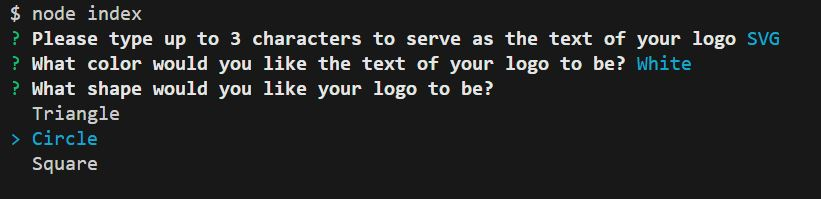

# My SVG Generator Project

## Description
The point of this project was to create an efficient means of generating .svg files with a clean and simple logo that contains a shape and some text of no more than 3 characters.  The result is a command-line application that prompts the user with questions, take their inputted answers about their desired logo specifications, and generates an .svg file that contains the logo they specified.

## Installation
This is a node project, so installation of this project will require  the user to have the latest version of nodejs downloaded.  To install this project, one must first clone this repo to their local device.  Then, navigate to the repository in their local integrated development environment and install the necessary packages using the "npm install" command in the terminal.  Having done this, the user can run the program from the command line with the command "node index".  The series of prompts used to generate the .svg file should then begin automatically.

## Usage
Upon running the application, this is a screenshot of what the prompts will look like.  

Following the completion of all of the prompts, an .svg file will be generated in the "output" folder that will contain a logo looking similar to this (varying depending on user responses):

The following is a link to a walkthrough video that demonstrates all of the functionality of the program:
[SVG Generator Walkthrough Video](https://drive.google.com/file/d/1pBAyY0r5bG6GCggrkw5iqIRjf8iBGTDK/view)

## Contributing
N/A

## Tests
To run the tests contained in the project, simply enter "npm run test"  or "npm test" into the command line with the project running.

## Credits
https://www.w3schools.com/graphics/tryit.asp?filename=trysvg_circle1

https://www.w3schools.com/graphics/tryit.asp?filename=trysvg_rect0

https://www.w3schools.com/graphics/tryit.asp?filename=trysvg_polygon